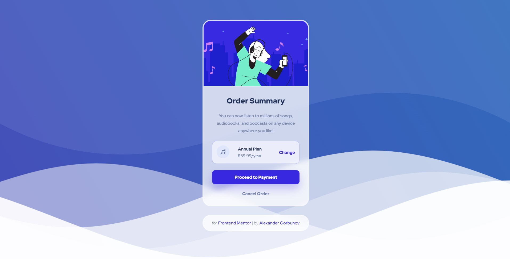

# Order Summary Card

<p align="center">
  
</p>

## ℹ️ About

This is a solution to the [Order summary card challenge on Frontend Mentor](https://www.frontendmentor.io/challenges/order-summary-component-QlPmajDUj).

* **Build out an order summary card component**. 
  * `/design` - Folder with  designs. Contains both a mobile and a desktop version of the design. 
  * `/images` - Folder with assets. The assets are already optimized.
  * `style-guide.md` - File with the style information: color palette, fonts, etc.
* **Get it looking as close to the design as possible**. 
* **Use any tools to like**. You can use any tools you like to help you complete the challenge**. So if you've got something you'd like to practice, feel free to give it a go.
* **Your users should be able to**:
  * See hover states for interactive elements

## ⚙️ Tools

* **HTML5**
  * Semantic HTML
* **CSS**
  * Flexbox
  * Responsive design
  * BEM naming convention
* **Github Pages** - for hosting

## 💡 Features

* **Glassy effect**. Card and footer have glassy effect
* **Hover and click animation on image**. Plus filter
* **Smooth animation**. `transition: 0.3s`
* **Hover and click animation on buttons**
* **Waves on background**. See this [codepen](https://codepen.io/goodkatz/pen/LYPGxQz?editors=1100)

## 🔗 Useful resources

- [Codepen : Goodkatz : Simple CSS Waves](https://codepen.io/goodkatz/pen/LYPGxQz?editors=1100) - Awesome moving waves
- [Codepen : Barbara Rodriguez : Gradient background with waves](https://codepen.io/baarbaracrr/pen/KKovmGb?editors=1100) - Moving background

## 📍 Additional information
 
### Glassy effect

White background + some opacity to the background color + `backdrop-filter`

```css
.class-name {
  background: rgba(255, 255, 255, 0.75);
  backdrop-filter: blur(8px);
}
```

### Smooth button animation

```css
.button {
  cursor: pointer;
  transition: .3s;
  width: 100%;
  border: none;
  font-size: 1rem;
  font-weight: 900;
  border-radius: .75rem;
}

.button:hover {
  transform: scale(.95);
}

.button:active {
  transform: scale(.85);
}
```

### Card image animation with `hue-rotate`

```css
.card__bg:hover .card__bg-image {
  transform: scale(1.25);
  filter: hue-rotate(45deg);
}

.card__bg:active .card__bg-image {
  transform: scale(1);
  filter: hue-rotate(90deg);
}
```

### Moving background

Removed unnecessary properties

```css
.page {
  background: linear-gradient(60deg, rgba(84,58,183,1) 0%, rgba(0,172,193,1) 100%);
  animation: gradient 15s ease infinite;
  background-size: 400% 400%;
  background-attachment: fixed;
}

@keyframes gradient {
  0% {
      background-position: 0% 0%;
  }
  50% {
      background-position: 100% 100%;
  }
  100% {
      background-position: 0% 0%;
  }
}
```

## 👤 Author

* Frontend Mentor - [@GrbnvAlex](https://www.frontendmentor.io/profile/GrbnvAlex)
* Telegram - [@Arlagonix](https://t.me/Arlagonix)
* Github - [@arlagonix](https://github.com/arlagonix)
